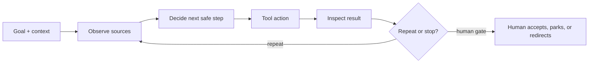

# Crew 2 Day 2 — bound and edit a ticket-coach agent

Mode: `FULLY GUIDED` · Time: `10:00–16:00` · Status: `FUTURE CURRICULUM`

Run all prompts and commands from the repository root.

## Outcome and boundary

Each learner copies the starter `ticket-coach` agent, invokes it on
`TICKET-OPS-101`, edits **one instruction**, and invokes it again on the same
`TICKET-OPS-101` with the same model, access, zoom, and prompt. Only after that
controlled comparison does the learner transfer to `TICKET-OPS-102`. The agent
may use only its three configured read-only tools: `Read`, `Glob`, and `Grep`.
It may not write files, create tickets, call GitLab/Jira/Confluence, use
credentials, or decide financial status.

Read [the ticket-agent guide](../../scenarios/ticket-agent/README.md),
[`ticket-inputs.md`](../../scenarios/ticket-agent/ticket-inputs.md), and the
[payment scenario](../../scenarios/payment-reconciliation/README.md).
If the ticket-agent guide is absent at preflight, record `OPEN` and use the
literal prompts below only as a dry run.

## Fixed agenda

| Time | Minutes | Block | Artifact |
| --- | ---: | --- | --- |
| 10:00–10:10 | 10 | Theory recap | Agent definition, loop, model/chat/agent/subagent distinction |
| 10:10–10:15 | 5 | Demo | Starter copy and preview-only run |
| 10:15–10:40 | 25 | Individual attempt | Copy starter and invoke TICKET-OPS-101 |
| 10:40–11:00 | 20 | Review | Scope and output readback |
| 11:00–11:10 | 10 | Break | — |
| 11:10–12:00 | 50 | Practice | Groups of 3–4, one navigator |
| 12:00–13:00 | 60 | Lunch | — |
| 13:00–13:20 | 20 | Check | Human boundary gate |
| 13:20–14:05 | 45 | Practice | Edit one instruction; rerun same 101 |
| 14:05–14:15 | 10 | Break | — |
| 14:15–15:05 | 50 | Transfer | Fresh reader compares runs |
| 15:05–15:15 | 10 | Break | — |
| 15:15–15:45 | 30 | Handoff | Prompt and run evidence |
| 15:45–16:00 | 15 | Close | Rating and MOB recap |

Total: **360 minutes**. Every learner completes the 25-minute individual
attempt before group work. Then groups use one navigator and rotate driver and
navigator every 5–7 minutes.

## Phase lens

`Plan`, `Design`, `Build` (creating the learner's local agent config), and a
bounded local `Test` are in scope. `Deploy` and `Maintain` are `NOT IN SCOPE —
the agent is previewed locally; no release or workflow integration is
performed`.

## Literal task cards

### 1. Agent recap and demo — 10:00–10:15

**Agent recap:** An agent is a system that pursues a bounded goal by using a
model, instructions, selected context, tools, and feedback. A model is the
prediction engine; a chat is a conversation with that model. An agent adds a
goal, context, actions, and inspection. A subagent is a smaller delegated
agent used for one bounded task inside a larger run.

Use this loop on the board before building:

The human owns the goal, scope, and gate. The ticket-coach is built only after
the group can name its input, allowed tools, output, and stop rule.

**Task card:** Show the starter copy, the ticket input, the three-tool
allow-list, and the human gate. Then invoke the preview-only agent.

**Example prompt:**

> Copy the starter ticket-coach agent into the learner project. Use the
> ticket-coach subagent. Read `scenarios/ticket-agent/ticket-inputs.md` and use
> the `TICKET-OPS-101` input. Return a draft that follows
> `scenarios/ticket-agent/ticket-template.md`. Preview the complete draft in
> chat; do not write files or use remote tools.

**Output:** Trainer's run transcript with requested paths and returned paths.

**Human acceptance:** Facilitator confirms the actual starter agent was copied
and invoked, its configured tools are `Read`, `Glob`, and `Grep`, and no file
or remote record was mutated.

### 2. Individual attempt — 10:15–10:40

**Task card:** Before the 25-minute timer, run the pack's preflight (`claude
--version`, clean copy, model/access/zoom, and `/skills`). Then invoke the
actual starter ticket-coach on `TICKET-OPS-101` and save
`lab-notes/crew-2/day-2-run-1.md`. Record prompt, allowed paths, output,
blocked actions, and human decision.

**Example prompt:**

> Use the ticket-coach subagent. Read
> `scenarios/ticket-agent/ticket-inputs.md` and use the `TICKET-OPS-101` input.
> Return a draft that follows `scenarios/ticket-agent/ticket-template.md`.
> Preview the complete draft in chat; do not write files or use remote tools.

**Output:** One observed run record, even if the guide or runtime is `OPEN`.

**Human acceptance:** Learner records the actual model, access mode, zoom,
selected input, available skills, and observed output; unrun checks are `OPEN`.

### 3. Review — 10:40–11:00

**Task card:** A reviewer compares the requested starter allow-list with the
actual run. Check that the agent did not invent an assignee, URL, policy, or
approval.

**Example prompt:**

> Review this run against the ticket-agent boundary. Mark `PASS`, `FAIL`, or
> `OPEN` for `Read`, `Glob`, `Grep`, no writes, no network, source citations,
> protected sections, and human acceptance. Quote one output line as evidence.

**Output:** Boundary readback with a parked issue if needed.

**Human acceptance:** Reviewer can explain one observed permission and one
permission the agent must not have.

### 4. Group practice — 11:10–12:00

**Task card:** Re-run the same starter prompt on `TICKET-OPS-101` in groups of
3–4. Navigator directs the human driver; skeptic checks path scope; scribe
captures the transcript.

**Example prompt:**

> Navigator: ask the driver to use the ticket-coach subagent on
> `TICKET-OPS-101` with the same prompt. Scribe: capture exact paths and
> output. Skeptic: pause on any write, remote call, invented ticket field, or
> unlabelled technical proposal. End with a human decision, not an agent
> approval.

**Output:** One group run record and one boundary question.

**Human acceptance:** Facilitator observes role rotation and a clean stop on a
disallowed operation.

### 5. Check — 13:00–13:20

**Task card:** Human gate the first `TICKET-OPS-101` run before changing the
agent body. Preserve the original prompt, model, access, zoom, input, and
transcript and record the exact decision.

**Example prompt:**

> As human reviewer, read the starter agent, original prompt, and transcript.
> Accept the run, request a correction, or mark it `OPEN`. State why the next
> run is bounded and identify exactly one body instruction that may change.

**Output:** `run-1 decision: PASS`, `FAIL`, or `OPEN`.

**Human acceptance:** Named reviewer role records the decision and no remote
ticket state is implied.

### 6. One instruction edit, then transfer — 13:20–14:05

**Task card:** Edit exactly one instruction in the starter agent body. Keep
model, access, zoom, prompt, input, and tools unchanged. Rerun the same agent
on the same `TICKET-OPS-101`; only after that comparison, transfer to
`TICKET-OPS-102`.

**Human editing instruction:**

> In your editor, add exactly this one sentence to the agent body: “For every technical
> proposal or test assumption, cite the exact input section; if the input does
> not support it, label it OPEN.” Keep the same prompt and
> `TICKET-OPS-101` input, then invoke the agent with the original prompt.
> The agent previews the draft and does not write files or create tickets.

**Output:** `lab-notes/crew-2/day-2-run-2.md` with one diffed instruction and
the second `TICKET-OPS-101` transcript, followed by a separate
`TICKET-OPS-102` transfer note.

**Human acceptance:** Facilitator verifies exactly one instruction changed,
the same `101` input and settings were used. Record differences as observations;
model output can vary even without an instruction edit, so this pair is not
causal proof. The `102` transfer is clearly separate.

### 7. Transfer — 14:15–15:05

**Task card:** Give both same-input runs and the later `102` transfer to a
fresh reader. They identify the changed instruction, permitted paths, and
whether the second ticket is a transfer rather than an experiment repeat.

**Example prompt:**

> Compare the two `TICKET-OPS-101` previews as a fresh reviewer. Point to the
> one instruction edit, one output difference or `OPEN — no visible
> difference`, and one unchanged boundary. Then inspect the `TICKET-OPS-102`
> transfer preview and mark missing runtime proof `OPEN`.

**Output:** Fresh-reader comparison attached to the two run records.

**Human acceptance:** Receiver finds the one edit and can repeat the boundary
check from the artifact alone.

### 8. Handoff and close — 15:15–16:00

**Task card:** Store prompts, model/access/zoom, transcripts, allowed paths,
human decisions, the same-input comparison, the `102` transfer, open
questions, and next practice. Close with rating and MOB recap.

**Example prompt:**

> Draft a handoff for another facilitator: starter copy, preflight settings,
> original prompt, one edited instruction, two `TICKET-OPS-101` previews,
> `TICKET-OPS-102` transfer, actual checks, reviewer decision, and `OPEN`
> items. Rate yourself independent, with help, or needs practice.
> Add one agreed navigator/driver lesson; exclude private feedback.

**Output:** `lab-notes/crew-2/day-2-handoff.md` or a local equivalent.

**Human acceptance:** Facilitator confirms the next person can rerun the
bounded exercise and see which evidence is still missing.

## Close script

Repeat the opening Kahoot and wordcloud. Ask: “What single instruction did we
change, and what remained bounded?” Record the group learning and keep any
individual rating private to the learner's recap.
