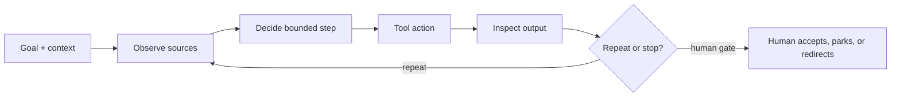

# Crew 2 Day 2 — build one bounded ticket agent in n8n, then Claude Code

Mode: `FULLY GUIDED` · Time: `10:00–16:00` · Status: `FUTURE CURRICULUM`

Participants use the [aetherlink-agent-lab](https://github.com/RyanLisse/aetherlink-agent-lab)
root repository as their learner workspace. The course [ticket-agent guide](../../scenarios/ticket-agent/README.md),
inputs, and template remain the trainer workbook and source of the contract;
they are kept separate from the participant path.

## Outcome and boundary

Each learner builds the same bounded ticket agent first in n8n and then in
Claude Code. Both runs use the identical instructions, `TICKET-OPS-101` input,
and output contract: a preview following `ticket-template.md`, exact source
citations, protected Current/Desired sections, and `OPEN` for unsupported
details. The learner captures settings, output, and a human decision for both
platforms, compares the two observations, and transfers to `TICKET-OPS-102`
only after that comparison is accepted.

n8n workflow credentials are chosen and checked separately in preflight. A
learner must be logged in with approved access; missing login or credentials is
`OPEN`, not proof of a run. The agent is preview-only: it cannot write files,
create or change business-system records, or approve financial status. No
SDK lesson is in scope.

Use the agent loop before either build: gather context → take action → verify
results, repeated, with the human able to interrupt at any point and owning
scope, interpretation, and acceptance (Claude Code docs, *The agentic loop*).



## Facilitator preflight

1. Open the lab root README and the trainer workbook. Confirm the participant
   starting instructions before scheduling the run.
2. Confirm the `TICKET-OPS-101` input and shared output contract in the
   workbook. Keep `TICKET-OPS-102` closed until the same-input comparison gate.
3. Choose the n8n credential and workflow access separately. Test the selected
   credential in the agreed training environment and record the observed
   result. Never store credentials here.
4. Confirm Claude Code access and record model/mode, zoom, revision, and
   timestamp where visible. Mark every unrun check `OPEN`.
5. Put the prompt below on the board and use it unchanged in both `101` runs.

## Fixed agenda — 10:00–16:00 (360 minutes)

| Time | Minutes | Block | Required learner action |
|---|---:|---|---|
| 10:00–10:10 | 10 | Theory | Define agent and loop before either build |
| 10:10–10:20 | 10 | n8n demo | Show credentialed login and preview boundary |
| 10:20–10:45 | 25 | Individual n8n run | Every learner runs alone on their own laptop |
| 10:45–11:00 | 15 | n8n review | Check the shared input/output contract |
| 11:00–11:10 | 10 | Break | — |
| 11:10–11:45 | 35 | n8n practice | Finish baseline and capture settings/evidence |
| 11:45–12:00 | 15 | Human gate | Accept, correct, or mark the `101` baseline `OPEN` |
| 12:00–13:00 | 60 | Lunch | — |
| 13:00–13:10 | 10 | Claude Code demo | Rebuild the same agent and contract |
| 13:10–13:35 | 25 | Individual Claude Code run | Run alone on the same `TICKET-OPS-101` |
| 13:35–13:50 | 15 | Claude Code review | Apply the same checklist and gate |
| 13:50–14:00 | 10 | Break | — |
| 14:00–14:30 | 30 | Comparison | Fresh reader compares identical instructions |
| 14:30–14:45 | 15 | Transfer gate | Only now run the unchanged method on `102` |
| 14:45–15:00 | 15 | Break | — |
| 15:00–15:40 | 40 | Handoff | Store runs, settings, decisions, and `OPEN` items |
| 15:40–16:00 | 20 | Close | Rating, MOB recap, and next practice |

Total: **360 minutes**. The 25-minute n8n and 25-minute Claude Code blocks
are individual own-laptop time. Group review or navigator rotation starts only
after the relevant individual block.

## Literal task cards

### 1. Theory and n8n demo — 10:00–10:20

Name the goal, input, allowed context/tools, output contract, and stop rule
before building. Explain model, chat, agent, and subagent briefly. Show the
n8n workflow only with the preflighted credential and login. If access is not
confirmed, show the intended steps as `OPEN` and do not imply execution.

Use this exact prompt for the n8n demo and the two `TICKET-OPS-101` runs:

```text
Read the supplied TICKET-OPS-101 input and return a preview that follows the shared ticket output contract. Cite the exact source sections for every factual field, preserve Current and Desired as protected sections, separate facts from assumptions, and label unsupported details OPEN. Do not write files, create or change business-system records, or approve financial status.
```

How the instruction is layered on the two platforms (record this, it is part
of the settings evidence): the shared functional instruction is
`scenarios/ticket-agent/shared-prompt.md` in the lab. In n8n it is embedded as
the AI Agent **system message** and the ticket text is the user message, so
nothing is typed at run time. In Claude Code it is the body of the
`ticket-coach` subagent, and the learner types the invocation from the lab's
ticket-agent README (`Use the ticket-coach subagent. Read … TICKET-OPS-101 …`).
The board prompt above is the human-readable summary of that contract, not a
third instruction; do not paste it into n8n or add it as hidden context.

### 2. Individual n8n baseline — 10:20–12:00

Open the lab root README, locate the ticket input and contract, run the bounded
workflow with approved access, and save the preview. Record the workflow
version, credential/access mode, model if visible, timestamp, paths, and
observed output. Review ticket identity, required headings, protected
sections, citations, assumptions, and `OPEN` labels. A human reviewer records
`PASS`, `FAIL`, or `OPEN` and freezes the baseline before lunch.

### 3. Claude Code rebuild and run — 13:00–13:50

Rebuild the same agent from the lab instructions. Keep the exact prompt,
`TICKET-OPS-101`, output contract, and evidence fields unchanged from n8n.
Record Claude Code model/mode and access, preview the result, and apply the
same checklist and human gate. If the lab or account is unavailable, record
`OPEN`; do not manufacture a comparison.

### 4. Compare the same input — 14:00–14:30

Give a fresh reviewer both `101` previews, the exact prompt, settings, and
contract. They identify one output difference or `OPEN — no observed
difference`, one unchanged boundary, and missing evidence. Describe n8n and
Claude Code differences as observations of these runs. Do not claim either
platform caused a difference; this exercise does not establish causality.

### 5. Transfer after the comparison — 14:30–14:45

After the human accepts the `TICKET-OPS-101` comparison, use the same agent
instructions and output contract with `TICKET-OPS-102` as the only input
change. Record it as a transfer, not another comparison. Do not open `102`
before the comparison is recorded.

### 6. Handoff and close — 15:00–16:00

Store the lab root URL, prompt, contract, n8n and Claude Code settings, both
`101` previews, comparison, human decisions, later `102` transfer, access
gaps, and next action in `lab-notes/crew-2/day-2-handoff.md` or the lab’s
equivalent. A fresh receiver must find both `101` runs and explain what is
`OPEN` in two minutes. Close with `independent`, `with help`, or `needs
practice`, plus one agreed navigator/driver lesson; keep personal feedback
private.

## Phase lens

`Plan`, `Design`, `Build`, and bounded local `Test` are in scope. `Deploy` and
`Maintain` are `NOT IN SCOPE — no workflow publication or business-system write,
or production operation is performed`.
