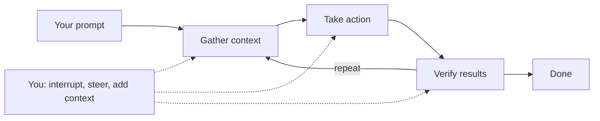

# Day 3 — What an agent is, and one agent built twice (n8n, then Claude Code)

Third session for **Wave 2 crew 1**. Two concepts today, nothing more:

1. **What an agent is — the agentic loop.** Gather context → take action →
   verify results, repeated, with you able to interrupt at any point.
2. **One contract, two platforms.** The same `ticket-coach` built in n8n in
   the morning and rebuilt in Claude Code after lunch, on the same
   `TICKET-OPS-101` input and output contract.

Participants use the [aetherlink-agent-lab](https://github.com/RyanLisse/aetherlink-agent-lab)
repository as their learner workspace. The course
[ticket-agent pack](../scenarios/ticket-agent/README.md) is the trainer
workbook, not the participant starting path.

## Session outcome and boundary

By 16:00 each participant has run the same functional contract and input on
both platforms, recorded each platform's adapter instructions, model, tools,
settings, and output, compared the two observations with a fresh reader, and
transferred the unchanged method to `TICKET-OPS-102` only after that comparison.

n8n credentials and access are preflighted separately; an unavailable login
is `OPEN`, not a run. Agents preview in chat and write nothing. No
business-system record is created or changed; no SDK lesson is in scope.

## Concept 1 — the agentic loop (10:15–10:35)

Source: Claude Code docs, *How Claude Code works → The agentic loop*. Use the
interactive loop slide (Step / Play / You interrupt) and say it in this order:

1. **Three phases that blend together.** *Gather context* (read files,
   search), *take action* (edit, draft, calculate), *verify results* (run the
   check, compare with the contract). Tools are used throughout.
2. **The loop adapts.** A question may need one pass of context gathering; a
   fix cycles all three phases many times. The agent decides the next step
   from what the previous step returned.
3. **You are in the loop.** Interrupt, steer, add context, or accept at the
   human gate. Autonomous, but responsive to you.
4. **Models reason, tools act.** Claude Code is the *harness* around the
   model: tools, context management, execution environment. n8n is another
   harness around a model. Same loop, different harness.
5. **Model · chat · agent · subagent**, one sentence each: a model predicts
   text; a chat is a model with a conversation; an agent is a model in a loop
   with tools and a goal; a subagent is an agent another agent delegates to,
   with its own context.



## Concept 2 — one contract, two platforms (10:35–10:45, then all day)

The shared functional contract is `scenarios/ticket-agent/shared-prompt.md` in
the lab. Both runs use the same `TICKET-OPS-101` input and output contract. In
n8n the contract is the AI Agent **system message**, the ticket text is the
user message, and the Calculator connection is a required tool adapter. In
Claude Code it is the body of the `ticket-coach` subagent, with the lab's
read-only `Read`, `Glob`, and `Grep` tools and the typed invocation as its
adapter. Record those adapter instructions, model, mode, access, and tools for
each run. The comparison therefore describes observations under the same
functional contract and input; one pair of runs proves no causal superiority.

Board prompt (human-readable summary of the contract, not a third instruction):

```text
Read the supplied TICKET-OPS-101 input and return a preview that follows the shared ticket output contract. Cite the exact source sections for every factual field, preserve Current and Desired as protected sections, separate facts from assumptions, and label unsupported details OPEN. Do not write files, create or change business-system records, or approve financial status.
```

## Facilitator preflight

1. Open the lab root README and the trainer ticket-agent pack; confirm the
   `TICKET-OPS-101` input and `ticket-template.md` contract. Keep `102` closed.
2. Test the n8n credential (Anthropic Chat Model by default; provider swap
   documented in the lab) in the agreed environment. Record the result.
3. Confirm Claude Code access and the local lab copy; record version, model
   shown, timestamp. Unrun = `OPEN`.
4. Open the Site deck for crew 1 day 3 and test the loop widget (Step, Play,
   You interrupt) on the room's screen.
5. Kahoot opener: "An agent is… (a) a smarter chat (b) a model in a loop with
   tools and a goal (c) a workflow"; wordcloud "Which step blocks you today?".

## Schedule — 10:00–16:00 (360 minutes)

| Time | Minutes | Activity |
|---|---:|---|
| 10:00–10:15 | 15 | Welcome back: Kahoot + wordcloud, Day 1–2 recap, today's two concepts |
| 10:15–10:35 | 20 | Concept 1: what an agent is — the agentic loop (interactive slide) |
| 10:35–10:45 | 10 | Concept 2 + n8n demo: one contract, two platforms |
| 10:45–11:10 | 25 | **Individual** n8n run on `TICKET-OPS-101` |
| 11:10–11:20 | 10 | Break |
| 11:20–11:45 | 25 | Groups of 3–4: n8n output against the contract |
| 11:45–12:00 | 15 | Human gate: n8n baseline frozen |
| 12:00–13:00 | 60 | Lunch |
| 13:00–13:10 | 10 | Claude Code demo: rebuild the same agent |
| 13:10–13:35 | 25 | **Individual** Claude Code run on the same `TICKET-OPS-101` |
| 13:35–13:45 | 10 | Break |
| 13:45–14:15 | 30 | Groups of 3–4: same-input comparison with a fresh reader |
| 14:15–14:30 | 15 | Human gate, then transfer unchanged to `TICKET-OPS-102` |
| 14:30–14:45 | 15 | Break |
| 14:45–15:25 | 40 | **Individual** evidence readback and handoff |
| 15:25–15:40 | 15 | Recap: the two concepts, one sentence each |
| 15:40–16:00 | 20 | Check-out, MOB reflection, Kahoot/wordcloud delta |

Total: **360 minutes**. Two 25-minute individual blocks, one per platform,
before any group work.

## Literal task cards

### Card 1 — individual n8n run (10:45–11:10, 25 min)

- **Goal:** one n8n baseline on `TICKET-OPS-101` with settings recorded.
- **Input:** lab `n8n/README.md`, `n8n/workflows/ticket-coach.json`, preflighted credential.
- **Steps:** import the workflow; select the credential in the UI; confirm Calculator is connected to the AI Agent's tool input; execute once; inspect the output and the intermediate steps for the Calculator call; record workflow version, model, access mode, execution time, output.
- **Result:** output + settings in your run log; login or credential problems as `OPEN`.
- **Time limit:** 25 min.

### Card 2 — groups of 3–4: n8n review (11:20–11:45, 25 min)

- **Goal:** each output checked against the contract by someone who did not run it.
- **Steps:** ticket identity, four headings, protected sections verbatim, Given/When/Then counts (≥2 positive, ≥2 negative), source citations, `OPEN` labels; quote one observed line; PASS / FAIL / OPEN.
- **Result:** a review line per person on the board; baseline frozen at the 11:45 gate.

### Card 3 — individual Claude Code run (13:10–13:35, 25 min)

- **Goal:** the same contract, same input, in Claude Code.
- **Steps:** from the lab root run `mkdir -p .claude/agents && cp -n scenarios/ticket-agent/starter/.claude/agents/ticket-coach.md .claude/agents/ticket-coach.md`; start Claude Code; type the README invocation unchanged; preview and save the accepted output to `participant-output/ticket-101-preview.md`; run `python3 scenarios/ticket-agent/check_ticket.py --input scenarios/ticket-agent/ticket-inputs.md --ticket TICKET-OPS-101 --output participant-output/ticket-101-preview.md`; record model/mode, read-only tools, output, and the checker line.
- **Result:** Claude Code baseline in the run log.
- **Time limit:** 25 min.

### Card 4 — groups of 3–4: same-input comparison (13:45–14:15, 30 min)

- **Goal:** one observed difference (or `OPEN — no observed difference`), one unchanged boundary, and any missing evidence, from a reader who saw neither run.
- **Steps:** hand over both records, prompt, settings, contract; the reader reports; describe differences as observations of these two runs, never as one platform causing them.
- **Result:** a comparison note per group; then the 14:15 gate and the `102` transfer with the method unchanged.

### Card 5 — individual evidence and handoff (14:45–15:25, 40 min)

- **Goal:** a fresh receiver finds both `101` runs and the `OPEN` items in two minutes.
- **Steps:** store lab URL, exact prompts, both settings, both outputs, checker lines, comparison, `102` transfer, access gaps, next action in `lab-notes/day-3-evidence.md` and `lab-notes/handoff-day-3.md`.
- **Result:** the two files.

## Recap and close — 15:25–16:00

Recap slide: one sentence per concept from the room — "An agent is…", "The
same contract on two platforms showed…". Then individual check-out (**Made**,
**Learned**, **Can do**), MOB reflection on the opening blocker, Kahoot and
wordcloud repeated with the delta recorded. Complete the
[daily recap](../templates/daily-recap.md), link it from `recaps/README.md`,
update `progress.md` with observed results only.

## Phase lens

`Plan`, `Design`, `Build`, bounded local `Test`. `Deploy` and `Maintain` are
`NOT IN SCOPE — no workflow publication or business-system write`.
