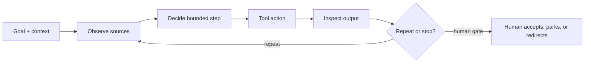

# Day 3 — Build one bounded agent twice: n8n, then Claude Code

This is the next session for **Wave 2 crew 1**, continuing from its completed
Days 1–2. Participants use the [aetherlink-agent-lab](https://github.com/RyanLisse/aetherlink-agent-lab)
repository as their learner workspace. The course [ticket-agent pack](../scenarios/ticket-agent/README.md)
remains the trainer workbook and source of the ticket contract; it is not the
participant starting path.

## Session outcome and boundary

By the close, each participant has built the same bounded ticket agent first in
n8n and then in Claude Code. Both runs use the identical `TICKET-OPS-101`
input, instruction text, and output contract: a preview following
`ticket-template.md`, with source-backed fields, protected Current/Desired
sections, and unsupported facts marked `OPEN`. The learner records the actual
settings, output, and human decision for each platform, compares observations
under identical instructions, and only then transfers the method to
`TICKET-OPS-102`.

n8n credentials and workflow access are selected and checked separately during
facilitator preflight. A learner must be logged in with approved access to run
the workflow; an unavailable credential or login is `OPEN`, not evidence that
the workflow ran. No business-system record is created or changed, and no SDK lesson is
in scope.

Use the agent loop before either build: goal/context → observe → decide → tool
action → inspect result → repeat or stop at a human gate. The human owns the
scope, interpretation, and acceptance decision.



## Facilitator preflight

1. Open the participant lab root README and the trainer ticket-agent pack.
2. Confirm the exact `TICKET-OPS-101` input and `ticket-template.md` output
   contract, including the four required headings, protected sections, source
   citations, and `OPEN` handling. Keep `TICKET-OPS-102` for transfer only.
3. Choose the n8n workflow credentials and access mode separately. Test the
   selected credential in the agreed training environment and record the
   observed result. Do not put credentials in this repository.
4. Confirm the Claude Code account/mode and the local lab copy. Record model,
   access, zoom, revision, and timestamp where visible. Use `OPEN` for an
   unrun check or missing access.
5. Put the identical prompt below on the board. The only permitted input change
   is `TICKET-OPS-101` to `TICKET-OPS-102`, and that happens after the comparison
   gate.

## Schedule — 10:00–16:00 (360 minutes)

| Time | Minutes | Activity |
|---|---:|---|
| 10:00–10:10 | 10 | Theory: agent definition and loop, before either build |
| 10:10–10:20 | 10 | n8n demo: build and preview the bounded agent |
| 10:20–10:45 | 25 | Individual n8n run on each participant’s own laptop |
| 10:45–11:00 | 15 | n8n output review against the shared contract |
| 11:00–11:10 | 10 | Break |
| 11:10–11:45 | 35 | Finish n8n run, capture settings and evidence |
| 11:45–12:00 | 15 | Human gate and baseline record for `TICKET-OPS-101` |
| 12:00–13:00 | 60 | Lunch |
| 13:00–13:10 | 10 | Claude Code rebuild demo using the same contract |
| 13:10–13:35 | 25 | Individual Claude Code run on the same `TICKET-OPS-101` |
| 13:35–13:50 | 15 | Claude Code output review against the same contract |
| 13:50–14:00 | 10 | Break |
| 14:00–14:30 | 30 | Compare n8n and Claude Code with identical instructions |
| 14:30–14:45 | 15 | Human gate, then transfer unchanged method to `TICKET-OPS-102` |
| 14:45–15:00 | 15 | Break |
| 15:00–15:40 | 40 | Evidence readback and receiver-ready handoff |
| 15:40–16:00 | 20 | Close: made, learned, can do, and next action |

Total: **360 minutes**. The first n8n individual block is 25 minutes on each
participant’s own laptop. Do not replace it with a group demonstration. Group
review may begin only after that block; driver rotation is optional during the
review and does not change the two controlled runs.

## Literal task cards

### 1. Theory and n8n demo — 10:00–10:20

State the agent goal, input, allowed context/tools, output contract, and stop
rule before touching either platform. Explain model, chat, agent, and
subagent in one sentence each. Demonstrate the n8n workflow with the selected
credential and login. If preflight did not confirm access, show the intended
steps as `OPEN` and do not imply a run.

Use this exact functional prompt with the supplied ticket input and contract
in the demo and both `TICKET-OPS-101` runs:

```text
Read the supplied TICKET-OPS-101 input and return a preview that follows the shared ticket output contract. Cite the exact source sections for every factual field, preserve Current and Desired as protected sections, separate facts from assumptions, and label unsupported details OPEN. Do not write files, create or change business-system records, or approve financial status.
```

The trainer maps the lab’s README and files to the course pack’s
`ticket-inputs.md` and `ticket-template.md`. Keep those links separate: the
lab is the learner path and the pack is the trainer workbook.

### 2. Individual n8n run — 10:20–10:45

Each participant works alone:

1. Open the lab root README and locate the ticket input and output contract.
2. Run the bounded n8n workflow with the approved, preflighted credential.
3. Use the exact functional prompt above with the supplied `TICKET-OPS-101`
   input; do not add hidden context.
4. Save the transcript or exported preview and record workflow version,
   credential/access mode, model if visible, timestamp, paths, and result.
5. Mark login, credential, or workflow checks `OPEN` when they were not
   observed. Do not fill missing facts from the course target or memory.

### 3. n8n review and baseline gate — 10:45–12:00

Check the preview against the shared contract: ticket identity, required
headings, protected sections, source citations, assumptions, and `OPEN`
labels. The human reviewer records `PASS`, `FAIL`, or `OPEN`, quotes one
observed line, and freezes the n8n baseline before lunch. A blocked credential
is an access result, not a successful agent run.

### 4. Claude Code rebuild and run — 13:00–13:50

Rebuild the same bounded agent in Claude Code from the lab instructions. Keep
the functional prompt, supplied `TICKET-OPS-101` input, output contract, and
evidence fields the same as n8n. Record Claude Code model/mode and access, then
preview the output without writing files or business-system records. Review it with the same checklist
and human gate. If the lab or account is unavailable, record `OPEN` and keep
the comparison bounded to the evidence that exists.

### 5. Same-input comparison — 14:00–14:30

Give a fresh reviewer the n8n and Claude Code records, the exact prompt, the
two settings records, and the shared contract. Ask them to identify one output
difference or `OPEN — no observed difference`, one unchanged boundary, and
any missing evidence. Describe platform differences as observations of these
runs. Do not claim that n8n or Claude Code caused a difference from this pair;
the comparison does not establish causality.

### 6. Transfer only after comparison — 14:30–14:45

After the human accepts the `TICKET-OPS-101` comparison, reuse the same agent
instructions and output contract with `TICKET-OPS-102` as the only input
change. Record it as a transfer, not a third comparison run. Do not open
`TICKET-OPS-102` before the same-input comparison is recorded.

### 7. Handoff and close — 15:00–16:00

Store the lab URL, exact prompt, input/output contract, n8n and Claude Code
settings, both previews, human decisions, comparison, the later `102`
transfer, access gaps, and next action in `lab-notes/day-3-evidence.md` and
`lab-notes/handoff-day-3.md` or the lab’s equivalent. A fresh receiver must
find the two `101` runs and explain what remains `OPEN` in two minutes.

Each person answers **Made**, **Learned**, and **Can do**, then records one
reproducible next step. Keep participant ratings private and report only
observed artifacts and access results. Complete the [daily recap](../templates/daily-recap.md)
and update the relevant [recap index](../recaps/README.md); do not record
fictional financial recovery or unobserved platform success.

## Phase lens

`Plan`, `Design`, `Build`, and bounded local `Test` are in scope. `Deploy` and
`Maintain` are `NOT IN SCOPE — no workflow publication or business-system write,
or production operation is performed`.
