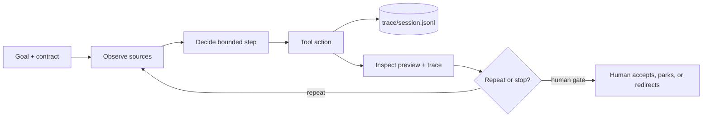

# Day 4 — Choose one agent and build it, with a trace you can read

This is the fourth session for **Wave 2 crew 1**. Day 3 gave everyone the same
`ticket-coach` in n8n and Claude Code. Today each participant **chooses one of
three agents** from the participant lab's
[agent menu](https://github.com/RyanLisse/aetherlink-agent-lab/blob/main/scenarios/agent-menu/README.md)
and builds it in Claude Code, step by step, with a local trace that shows what
the agent did. Day 5 hardens the same agent.

| Option | Agent | Closest real task |
|---|---|---|
| A | `ticket-triage` — six FIN tickets → Jira-shaped triage lines | grooming the queue before stand-up |
| B | `runbook-writer` — one reviewed run log → Confluence-shaped runbook | turning a done ticket into a procedure |
| C | `repo-reviewer` — this repository → findings with file evidence | reviewing a merge request for consistency |
| Stretch | `retro-writer` — fictional Jira sprint export → retro draft | only after A, B, or C passed the checker |

## Session outcome and boundary

By 16:00 every participant has: one chosen agent installed from the lab
starter, two runs of it on their own laptop, a trace summary that answers
*what did it ask, read, delegate, and write*, a checker result, a completed
run log, and one accepted output saved by themselves under
`participant-output/`. Groups of 3–4 form only after the individual block.

All inputs are fictional and local. Agents use `Read`, `Glob`, `Grep` only and
preview in chat; the human saves what they accept. No Jira, GitLab,
Confluence, PSP, or bank record is created, changed, or implied; no SDK
deployment or hosting is in scope. A missing model or login is `OPEN`, not a
run.

The loop is the Day 3 loop with one addition — the trace:

## Facilitator preflight

1. Pull the lab and read `scenarios/agent-menu/README.md` and
   `observability.md`; open each option README once.
2. On the trainer laptop, install the starter (`cp -Rn scenarios/agent-menu/starter/.claude .claude`),
   start Claude Code in the checkout root, run Option A's first prompt, and
   confirm `trace/<session>.jsonl` exists and
   `python3 scenarios/agent-menu/tools/trace_summary.py` prints four sections.
   Record Claude Code version and the model shown. If anything fails, the
   demo shows the intended steps as `OPEN`.
3. Confirm Claude Code access for every participant was working on Day 3;
   unresolved logins are `OPEN` on the board before 10:15.
4. Put the menu table and the four trace questions on the board.
5. Prepare Kahoot: opener "Which of these does a trace prove? (a) the answer
   is correct (b) which files were read (c) the model understood the ticket";
   wordcloud "Which step blocks you today?".

## Schedule — 10:00–16:00 (360 minutes)

| Time | Minutes | Activity |
|---|---:|---|
| 10:00–10:15 | 15 | Open: Kahoot + wordcloud, Day 3 recap, blockers on the board |
| 10:15–10:35 | 20 | Theory: contract, adapter, trace — why a menu of agents shares one loop |
| 10:35–10:50 | 15 | Menu walk-through, choice, starter install |
| 10:50–11:15 | 25 | **Individual** Card 1: first run of the chosen agent |
| 11:15–11:25 | 10 | Break |
| 11:25–11:45 | 20 | Groups of 3–4, Card 2: trace versus citations |
| 11:45–12:00 | 15 | Human gate: checker result and run log frozen |
| 12:00–13:00 | 60 | Lunch |
| 13:00–13:15 | 15 | Demo: reading one participant's trace aloud |
| 13:15–13:40 | 25 | **Individual** Card 3: second run with the agreed correction |
| 13:40–13:50 | 10 | Break |
| 13:50–14:30 | 40 | Groups of 3–4, Card 4: explain your agent using only its trace |
| 14:30–14:45 | 15 | Break |
| 14:45–15:25 | 40 | **Individual** Card 5: complete run log, save accepted output, draft handoff |
| 15:25–15:40 | 15 | Recap: what each option taught, one sentence per option |
| 15:40–16:00 | 20 | Individual check-out, MOB reflection, Kahoot/wordcloud delta |

Total: **360 minutes**. Two individual blocks of 25 minutes and one of 40;
group work never replaces them.

## Theory block — 10:15–10:35 (say it in this order)

1. **Contract before agent.** Each option README defines the output shape the
   checker verifies. Same rule as `ticket-template.md` on Day 3.
2. **Adapter versus instruction.** The subagent file is the instruction; the
   tools (`Read`, `Glob`, `Grep`) are the adapter. Swapping the option swaps
   the instruction, not the loop.
3. **Trace = observability.** A hook writes one line per tool call to
   `trace/<session>.jsonl`. It proves *what ran*, never *what is correct*.
   Show the four questions: asked, read, delegated, wrote.
4. **Human gate is still the last step.** Checker PASS + trace + your review
   = evidence. Any one alone is not.

## Literal task cards

### Card 1 — first run (individual, 10:50–11:15, 25 min)

- **Goal:** a complete preview from your chosen agent plus its trace summary.
- **Input:** your option README (contract + exact prompt); the files it names.
- **Steps:**
  1. `cp -Rn scenarios/agent-menu/starter/.claude .claude`; start Claude Code in the checkout root.
  2. Fill the header of `templates/run-log.md` (option, model shown, tools).
  3. Type the option's first prompt **unchanged**. Watch the files it opens.
  4. `python3 scenarios/agent-menu/tools/trace_summary.py` — copy the four answers into the run log.
  5. Read the preview. Save it yourself to `participant-output/<option>.md` only if you accept it as a draft.
  6. `python3 scenarios/agent-menu/tools/check_menu_output.py --agent <name> --output participant-output/<option>.md`
- **Result:** preview, trace summary, checker line, run log with PASS/FAIL/OPEN.
- **Time limit:** 25 min. Unfinished = where you stopped, as `OPEN`.

### Card 2 — trace versus citations (groups of 3–4, 11:25–11:45, 20 min)

- **Goal:** one source the agent cited but never read, or one it read but never cited.
- **Input:** each member's trace summary and preview.
- **Steps:** compare "Sources read" with the output's `Source:` / `[source: …]` lines; check one number by hand against the file; agree one correction phrased as a single added sentence to the prompt, or as an `OPEN`.
- **Result:** one agreed correction per group on the board.
- **Time limit:** 20 min.

### Card 3 — second run (individual, 13:15–13:40, 25 min)

- **Goal:** the correction applied without breaking the contract.
- **Steps:** same prompt + the agreed sentence; new trace; checker; write in the run log what the agent read differently.
- **Result:** two traces, two checker lines, one sentence on the difference.
- **Time limit:** 25 min.

### Card 4 — explain your agent from its trace (groups of 3–4, 13:50–14:30, 40 min)

- **Goal:** a neighbour who chose a different option describes your run correctly from your trace alone.
- **Steps:** swap trace summaries, not outputs; the reader states what was asked, the first file read, whether a subagent ran, and whether anything was written; then compare with the output; each group records one mismatch or "none observed" and one prompt-wording lesson.
- **Result:** the mismatch and lesson on the board; groups mixing two options report first.
- **Time limit:** 40 min.

### Card 5 — evidence and handoff draft (individual, 14:45–15:25, 40 min)

- **Goal:** a run log a fresh reader can follow and the accepted output saved.
- **Steps:** complete every field of `templates/run-log.md`; save the accepted preview; start `templates/handoff.md` with option, prompt, settings, checker line, trace file name, and `OPEN` items; leave the Day 5 evaluator section empty.
- **Result:** `lab-notes/day-4-run-log.md`, `participant-output/<option>.md`, handoff draft.
- **Time limit:** 40 min.

## Recap and close — 15:25–16:00

Recap: one sentence per option from the group that chose it ("A taught us…").
Then each person answers **Made**, **Learned**, **Can do** individually,
followed by the MOB reflection: revisit the opening wordcloud blocker and name
one prompt correction that worked. Repeat the Kahoot question and record the
delta. Complete the [daily recap](../templates/daily-recap.md), link it from
`recaps/README.md`, and update `progress.md` with observed results only. Do
not record unobserved agent success or fictional financial recovery.

## Phase lens

`Plan`, `Design`, `Build`, and bounded local `Test` are in scope. `Deploy` and
`Maintain` are `NOT IN SCOPE — no hosting, schedule, or business-system write`.
