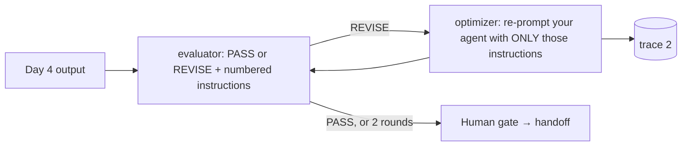

# Day 5 — Verify results, then close the loop: evaluator and handoff

Final session for **Wave 2 crew 1**. Two concepts:

1. **Verify results with an evaluator.** The evaluator-optimizer pattern: a
   second agent judges your output against the written contract and returns
   PASS or REVISE with numbered instructions; your agent applies only those.
   Pattern reference: <https://platform.claude.com/cookbook/patterns-agents-evaluator-optimizer>.
2. **Close the loop with a handoff.** Compare two traces, write the handoff,
   and let a fresh reader reproduce your run without you — the Maintain stage
   of the AI-native loop.

## Session outcome and boundary

By 16:00 every participant has: an evaluator verdict on their Day 4 output,
at most two optimizer rounds with traces, a trace comparison written in the
run log, a handoff that another participant reproduced, and a personal
statement of what transfers to Jira, GitLab, and Confluence work next week.

Same boundary as Days 3–4: fictional local inputs, read-only tools, preview
only, human saves. The evaluator judges; it never rewrites. No hosting,
schedules, or business-system writes. Anything not observed is `OPEN`.

## Facilitator preflight

1. On the trainer laptop, run the `evaluator` prompt from an option README on
   a saved Day 4 output. Confirm the verdict shape passes
   `check_menu_output.py --agent evaluator`. Record version and model shown.
2. Have one deliberately weak output ready (for example a triage report with
   an invented owner) so the demo shows a `REVISE` with instructions.
3. Board: the evaluator's five criteria (shape, grounding, no invented facts,
   OPEN discipline, boundary) and the rule "maximum two rounds".
4. Prepare Kahoot: opener "The evaluator says PASS. What do you still need
   before handing over? (a) nothing (b) a trace (c) a human review (d) b and c";
   wordcloud "Which step blocks you today?"; closing question "Which agent will
   you run on a real ticket next week, with a buddy?".

## Schedule — 10:00–16:00 (360 minutes)

| Time | Minutes | Activity |
|---|---:|---|
| 10:00–10:15 | 15 | Welcome back: Kahoot + wordcloud, Day 4 recap, today's two concepts |
| 10:15–10:35 | 20 | Concept 1: verify results — the evaluator-optimizer pattern |
| 10:35–10:45 | 10 | Demo: evaluator on a weak output → `REVISE` with instructions |
| 10:45–11:10 | 25 | **Individual** Card 1: evaluator round 1 on your Day 4 output |
| 11:10–11:20 | 10 | Break |
| 11:20–11:45 | 25 | **Individual** Card 2: optimizer step, trace 2 |
| 11:45–12:00 | 15 | Human gate: verdicts and round count recorded |
| 12:00–13:00 | 60 | Lunch |
| 13:00–13:15 | 15 | Concept 2: close the loop — handoff and Maintain; two traces side by side |
| 13:15–13:35 | 20 | Groups of 3–4, Card 3: trace swap |
| 13:35–13:45 | 10 | Break |
| 13:45–14:25 | 40 | **Individual** Card 4: write the handoff |
| 14:25–14:40 | 15 | Break |
| 14:40–15:20 | 40 | Groups of 3–4, Card 5: fresh-reader reproduction |
| 15:20–15:40 | 20 | Recap: five days, evidence wall, what transfers to Jira/GitLab/Confluence |
| 15:40–16:00 | 20 | Check-out, MOB reflection, Kahoot close against the Day 1 baseline |

Total: **360 minutes**. Three individual blocks (25, 25, 40) precede the
group work that uses them.

## Concept 1 — verify results: evaluator-optimizer (10:15–10:35)

1. **Evaluator-optimizer.** One agent produces, a second judges against a
   written contract and returns PASS or REVISE with numbered instructions; the
   producer applies only those. Two roles, one contract, bounded rounds.
2. **Why a separate evaluator.** It cannot see the producer's reasoning, only
   the output and the sources — the same position a colleague is in.
3. **Verify is a phase of the loop, not an afterthought.** Gather context →
   take action → *verify results*. The evaluator is that third phase made
   explicit and independent.

## Concept 2 — close the loop: handoff and Maintain (13:00–13:15)

1. **What a trace proves.** Which files were read, in which order, whether a
   subagent ran, whether anything was written. **What it cannot prove:**
   correctness, arithmetic, understanding. Say `OPEN` for those. Show two
   traces of one participant side by side: added files, dropped files, writes.
2. **Handoff test.** Not "I explained it" but "someone reproduced it from the
   text in ten minutes". In the AI-native loop this is Maintain — closing the
   loop so the next person starts from evidence, not memory.

## Literal task cards

### Card 1 — evaluator round 1 (individual, 10:45–11:10, 25 min)

- **Goal:** a verdict in the contract shape on your Day 4 output.
- **Input:** `participant-output/<option>.md`, your option README, the evaluator prompt in that README.
- **Steps:**
  1. Start Claude Code in the checkout root (starter already installed).
  2. Type the option's evaluator prompt unchanged.
  3. Save the verdict yourself to `participant-output/evaluation.md`.
  4. `python3 scenarios/agent-menu/tools/check_menu_output.py --agent evaluator --output participant-output/evaluation.md`
  5. Record verdict and every FAIL criterion in the run log's Day 5 section.
- **Result:** evaluation saved, checker line, run log updated.
- **Time limit:** 25 min.

### Card 2 — optimizer step (individual, 11:20–11:45, 25 min)

- **Goal:** the revise instructions applied, nothing else changed.
- **Steps:** if `REVISE`, re-run your agent's first prompt plus "Apply these instructions:" and the numbered list verbatim; new trace; save as `participant-output/<option>-v2.md`; run the option checker; run the evaluator once more (round 2 is the last). If `PASS` in round 1, run the agent once more with the same prompt and compare traces anyway — repeatability is evidence too.
- **Result:** v2 output, trace 2, round count, second verdict.
- **Time limit:** 25 min.

### Card 3 — trace swap (groups of 3–4, 13:15–13:35, 20 min)

- **Goal:** state the difference between trace 1 and trace 2 of a neighbour without seeing their outputs.
- **Steps:** follow the reading exercise in the lab's `observability.md`; each reader names files added or dropped between runs and whether any write appeared; compare with the author's run log.
- **Result:** one observed trace difference per person on the board, or "none observed".
- **Time limit:** 20 min.

### Card 4 — handoff (individual, 13:45–14:25, 40 min)

- **Goal:** a handoff a stranger can execute.
- **Steps:** complete `templates/handoff.md`: option, exact prompts, Claude Code version and model shown, files read (from the trace), checker and evaluator lines, both trace file names, what remains `OPEN`, and the one command to reproduce; save as `lab-notes/handoff-day-5.md`.
- **Result:** the handoff file.
- **Time limit:** 40 min.

### Card 5 — fresh-reader reproduction (groups of 3–4, 14:40–15:20, 40 min)

- **Goal:** a neighbour reproduces your run from the handoff alone in ten minutes.
- **Steps:** rotate handoffs one seat; the reader follows the text on their own laptop, silently noting each hesitation; at ten minutes they report reproduced / partially / blocked and their hesitations; the author fixes wording only, not scope.
- **Result:** reproduction status per handoff on the board; hesitations fixed in the file.
- **Time limit:** 40 min.

## Course recap — 15:20–15:40

Walk the evidence wall day by day: intent and plan (Day 1), guided ticket
relay (Day 2), one agent twice (Day 3), chosen agent with a trace (Day 4),
evaluator and handoff (Day 5). Ask each group: which of A, B, C would you run
first on a real Jira ticket, GitLab MR, or Confluence page — and which
approval, access, or data decision is `OPEN` before you may? Record the
answers as the crew's next-step list, not as commitments.

## Close — 15:40–16:00

Individual check-out: **Made**, **Learned**, **Can do**, plus one agent I will
run with a buddy next week. MOB reflection: revisit the Day 5 opening blocker
and the Day 1 baseline Kahoot; record the delta. Complete the
[daily recap](../templates/daily-recap.md), link it from `recaps/README.md`,
update `progress.md`. Record only observed artifacts; personal ratings stay
private.

## Phase lens

`Plan`, `Design`, `Build`, bounded local `Test`, and a local `Review` gate are
in scope. `Deploy` and `Maintain` are `NOT IN SCOPE — no hosting, schedule, or
business-system write`.
